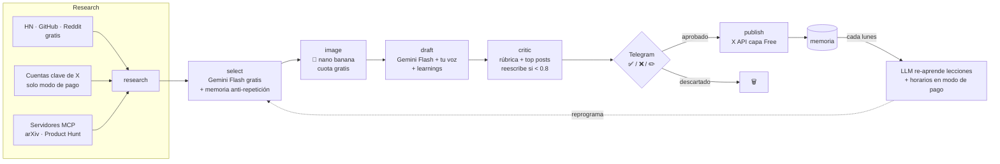

<div align="center">

# 🤖🍌 zanaX

**Tu cuenta de X creciendo sola en el mundo AI/dev: investiga, escribe con tu voz, genera imágenes y publica — tú solo apruebas desde Telegram. Corre gratis en tu Android con Termux (~$0/mes).**

[](https://python.org)
[](https://langchain-ai.github.io/langgraph/)
[](https://ai.google.dev)
[](https://railway.app)
[](LICENSE)

</div>

---

## 🧠 Cómo funciona



## ✨ Módulos

| Módulo | Qué hace | Archivo |
|---|---|---|
| **Research** | Tendencias de HN, GitHub Trending, Reddit y DuckDuckGo News | `src/agent/tools.py` |
| **MCP Sources** | Fuentes extra vía **Model Context Protocol** (arXiv, Product Hunt…) configurables en `MCP_SERVERS` | `src/agent/mcp_sources.py` |
| **X Research** | Lee cuentas que publican a diario (`X_ACCOUNTS`) — solo modo de pago; en FREE_MODE aporta 0 items | `src/agent/x_research.py` |
| **LLM multi-provider** | Gemini Flash para todo (capa gratis de AI Studio); conmutable a OpenAI/Claude | `src/agent/llm.py` |
| **Imágenes** | nano banana (`gemini-2.5-flash-image`), generadas antes de redactar | `src/agent/images.py` |
| **Tu voz** | Guía de estilo + few-shot con tus tuits reales | `src/agent/style.py` |
| **Grafo** | research → select → image → draft → **critic** | `src/agent/graph.py` |
| **Crítico** | Puntúa contra rúbrica + tus posts top históricos (modelo distinto al redactor); reescribe si < `CRITIC_THRESHOLD` | `src/agent/critic.py` |
| **Memoria** | Temas cubiertos (anti-repetición) + lecciones semanales de tu engagement real | `src/agent/memory.py` |
| **Timing** | FREE_MODE: horas fijas `POST_HOURS`. Modo de pago: aprende de tu engagement real | `src/agent/timing.py` |
| **Growth** | Respuestas con tu voz a posts del nicho (solo modo de pago; follow/unfollow a mano) | `src/agent/growth.py` |
| **Aprobación** | Bot de Telegram: ✅ publica · ❌ descarta · cita el mensaje para editar | `src/approval.py` |
| **Publisher** | Posts, respuestas e imágenes vía X API v2; `DRY_RUN` = modo prueba | `src/x_client.py` |

## 🚀 Quickstart (15 min)

1. **Telegram** → bot con [@BotFather](https://t.me/BotFather) + tu `chat_id` con [@userinfobot](https://t.me/userinfobot)
2. **X API** → [developer.x.com](https://developer.x.com) capa **Free**: las 4 claves OAuth de tu app (alcanza para publicar)
3. **Google** → key gratis en [AI Studio](https://aistudio.google.com/apikey) (LLM + nano banana con la misma key)
4. **Tu voz** → pon 3-5 tuits tuyos en `src/agent/style.py`
5. **Arranca** (en Termux ver la sección 📱):

```bash
cp .env.example .env   # rellena las claves
pip install -r requirements.txt
python -m src.main     # ciclo de prueba al iniciar
```

> [!WARNING]
> Arranca siempre con `DRY_RUN=true`: recibirás los borradores en Telegram sin publicar nada. Cuando la voz te convenza, pon `DRY_RUN=false`.

## ⚙️ Configuración

| Variable | Default | Para qué |
|---|---|---|
| `LLM_PROVIDER` | `google` | `google` · `openai` · `anthropic` |
| `LLM_MODEL` | `gemini-2.5-flash` | Tareas baratas: selección, prompts, timing |
| `FREE_MODE` | `true` | **Modo gratis**: cero lecturas de X, horas fijas, LLM por capa gratuita |
| `LLM_MODEL_DRAFT` | `gemini-2.5-flash` | Redacción de posts y comentarios |
| `X_BEARER_TOKEN` | — | Solo en modo de pago (`FREE_MODE=false`) |
| `X_ACCOUNTS` | OpenAI, DeepMind… | Cuentas a vigilar (solo modo de pago) |
| `ENABLE_IMAGES` | `true` | nano banana 🍌 por cuota gratis de AI Studio |
| `POSTS_PER_DAY` | `3` | Borradores por ciclo (2 ciclos/día = 6 posts/día) |
| `IMAGE_RATIO` | `0.5` | Fracción de posts con imagen (0.5 = la mitad) |
| `POST_HOURS` | `9,18` | Horas fijas de publicación (FREE_MODE) |
| `MEMORY_ENABLED` | `true` | Memoria de contenido (anti-repetición + learnings) |
| `CRITIC_THRESHOLD` | `0.8` | Nota mínima del crítico para mandarte el post |
| `CRITIC_MAX_RETRIES` | `2` | Reescrituras máximas por borrador |
| `MCP_SERVERS` | `[]` | JSON con servidores MCP extra (arXiv, Product Hunt…) |
| `DRY_RUN` | `true` | `true` = no publica nada |

## ⏰ Horarios

- **FREE_MODE (default)**: horas fijas de `POST_HOURS` (ej. `9,18`) — cero coste.
- **Modo de pago** (`FREE_MODE=false` + Bearer Token): un job diario refresca likes/RTs y cada lunes un LLM decide tus 2 mejores horas; el scheduler se reprograma solo.

En ambos modos la memoria evita repetir temas ya cubiertos y el crítico filtra borradores flojos antes de Telegram.

## 📈 Crecimiento

- **Seguir/dejar de seguir/comentar**: a mano desde la app de X — gratis y sin riesgo anti-spam. (Las respuestas propuestas automáticas solo están en modo de pago, porque requieren leer X.)

> [!WARNING]
> **Coste pay-per-use (2026):** cada post **con link** cuesta $0.20 en la API de X — por eso el agente nunca pone links en los posts.

## 💰 Coste: ~$0/mes (FREE_MODE)

| Concepto | Cómo es gratis |
|---|---|
| Posts (6/día) | Capa Free de la API de X (~500 posts/mes, máx. 17/día) |
| Research | HN, GitHub Trending, Reddit, DuckDuckGo — sin API key |
| LLM (Flash para todo) | Capa gratis de AI Studio (~1.500 req/día) |
| Imágenes (3/día) | Cuota gratis de AI Studio; si se agota, post sin imagen |
| Infra | Tu Android con Termux (wake-lock) |
| Telegram | Gratis |

**Lo que NO incluye el modo gratis** (requiere API de X de pago): leer cuentas del nicho, métricas de engagement (timing aprendido) y respuestas propuestas automáticas. Para activarlos: `FREE_MODE=false` + `X_BEARER_TOKEN` + plan con lecturas (~$25–45/mes).

## 📱 Ejecutar en Termux (Android, gratis)

1. Instala [Termux](https://f-droid.org/en/packages/com.termux/) (F-Droid, no Play Store) y opcionalmente **Termux:Boot**
2. ```bash
   pkg install git
   git clone https://github.com/riquelmechile/zanaX.git
   cd zanaX && bash termux-setup.sh
   nano .env   # rellena tus claves
   termux-wake-lock
   python -m src.main
   ```
3. Para que arranque solo al encender el teléfono, crea `~/.termux/boot/start-zanax.sh` (ver al final de `termux-setup.sh`)

Notas:
- `DATA_DIR=./data` (default): la memoria vive dentro del repo, en el teléfono
- Si `pydantic-core` falla al instalar: `pkg install tur-repo && pkg install python-pydantic` y reintenta
- Android mata procesos en segundo plano: el `termux-wake-lock` y desactivar la "optimización de batería" para Termux son obligatorios

## ☁️ Deploy en Railway (alternativa de pago, 24/7)

1. **New Project → Deploy from GitHub repo** (detecta el `Dockerfile` solo)
2. En **Variables**, pega todo tu `.env`
3. Listo: corre 24/7 (~$5/mes)

VPS alternativo: `docker build -t zanax . && docker run --env-file .env zanax`

## 🗺️ Roadmap

- [x] Grafo research → select → image → draft
- [x] Imágenes nano banana 🍌
- [x] Timing aprendido con LLM
- [x] Growth manual (follow/unfollow a mano, $0 y sin riesgo)
- [x] FREE_MODE: corre 100% gratis en Termux (Android)
- [x] Memoria de temas ya cubiertos (anti-repetición) + learnings de engagement
- [x] Crítico grounded que reescribe borradores antes de pedir aprobación
- [x] Fuentes extra vía MCP (arXiv, Product Hunt…)
- [ ] Hilos (threads) automáticos para tendencias grandes
- [ ] Dashboard de métricas en Telegram (`/stats`)

## ⚖️ Disclaimer

Automatización responsable: respeta las [reglas de la plataforma X](https://help.x.com/rules-and-policies/platform-rules). Los límites de este repo existen para proteger tu cuenta — no los subas de golpe. El contenido siempre se reformula con voz propia; nunca copies posts de terceros.

---

<div align="center">
Hecho con 🧠 + 🍌 · ¿Dudas? Abre un issue
</div>
