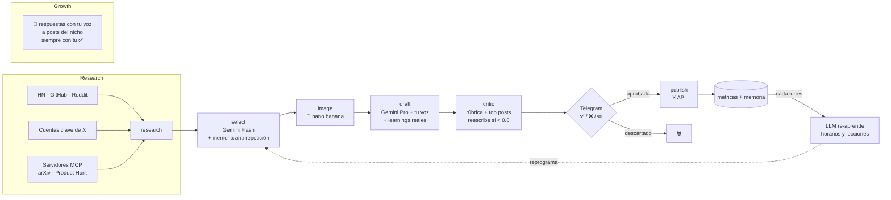

<div align="center">

# 🤖🍌 zanaX

**Tu cuenta de X creciendo sola en el mundo AI/dev: investiga, escribe con tu voz, genera imágenes y publica en el mejor momento — tú solo apruebas desde Telegram.**

[](https://python.org)
[](https://langchain-ai.github.io/langgraph/)
[](https://ai.google.dev)
[](https://railway.app)
[](LICENSE)

</div>

---

## 🧠 Cómo funciona



## ✨ Módulos

| Módulo | Qué hace | Archivo |
|---|---|---|
| **Research** | Tendencias de HN, GitHub Trending, Reddit y DuckDuckGo News | `src/agent/tools.py` |
| **MCP Sources** | Fuentes extra vía **Model Context Protocol** (arXiv, Product Hunt…) configurables en `MCP_SERVERS` | `src/agent/mcp_sources.py` |
| **X Research** | Lee cuentas que publican a diario (`X_ACCOUNTS`), rankeadas por engagement | `src/agent/x_research.py` |
| **LLM multi-provider** | Gemini Flash (análisis) + Gemini Pro (redacción); conmutable a OpenAI/Claude | `src/agent/llm.py` |
| **Imágenes** | nano banana (`gemini-2.5-flash-image`), generadas antes de redactar | `src/agent/images.py` |
| **Tu voz** | Guía de estilo + few-shot con tus tuits reales | `src/agent/style.py` |
| **Grafo** | research → select → image → draft → **critic** | `src/agent/graph.py` |
| **Crítico** | Puntúa contra rúbrica + tus posts top históricos (modelo distinto al redactor); reescribe si < `CRITIC_THRESHOLD` | `src/agent/critic.py` |
| **Memoria** | Temas cubiertos (anti-repetición) + lecciones semanales de tu engagement real | `src/agent/memory.py` |
| **Timing** | Aprende tus mejores horas con tu engagement real; reprograma el scheduler | `src/agent/timing.py` |
| **Growth** | Respuestas con tu voz a posts del nicho, siempre con tu aprobación | `src/agent/growth.py` |
| **Aprobación** | Bot de Telegram: ✅ publica · ❌ descarta · cita el mensaje para editar | `src/approval.py` |
| **Publisher** | Posts, respuestas e imágenes vía X API v2; `DRY_RUN` = modo prueba | `src/x_client.py` |

## 🚀 Quickstart (15 min)

1. **Telegram** → bot con [@BotFather](https://t.me/BotFather) + tu `chat_id` con [@userinfobot](https://t.me/userinfobot)
2. **X API** → [developer.x.com](https://developer.x.com) plan Basic: 4 claves OAuth + Bearer Token
3. **Google** → key gratis en [AI Studio](https://aistudio.google.com/apikey) (LLM + nano banana con la misma key)
4. **Tu voz** → pon 3-5 tuits tuyos en `src/agent/style.py`
5. **Arranca**:

```bash
cp .env.example .env   # rellena las claves
pip install -r requirements.txt
python -m src.main     # ciclo de prueba al iniciar
```

> [!WARNING]
> Arranca siempre con `DRY_RUN=true`: recibirás los borradores en Telegram sin publicar nada. Cuando la voz te convenza, pon `DRY_RUN=false`.

## ⚙️ Configuración

| Variable | Default | Para qué |
|---|---|---|
| `LLM_PROVIDER` | `google` | `google` · `openai` · `anthropic` |
| `LLM_MODEL` | `gemini-2.5-flash` | Tareas baratas: selección, prompts, timing |
| `LLM_MODEL_DRAFT` | `gemini-2.5-pro` | Redacción de posts y comentarios |
| `X_BEARER_TOKEN` | — | Leer cuentas, tendencias y métricas |
| `X_ACCOUNTS` | OpenAI, DeepMind… | Cuentas a vigilar (sin `@`, por comas) |
| `ENABLE_IMAGES` | `false` | Activa nano banana 🍌 |
| `POSTS_PER_DAY` | `3` | Borradores por ciclo (2 ciclos/día = 6 posts/día) |
| `IMAGE_RATIO` | `0.5` | Fracción de posts con imagen (0.5 = la mitad) |
| `MEMORY_ENABLED` | `true` | Memoria de contenido (anti-repetición + learnings) |
| `CRITIC_THRESHOLD` | `0.8` | Nota mínima del crítico para mandarte el post |
| `CRITIC_MAX_RETRIES` | `2` | Reescrituras máximas por borrador |
| `MCP_SERVERS` | `[]` | JSON con servidores MCP extra (arXiv, Product Hunt…) |
| `DRY_RUN` | `true` | `true` = no publica nada |

## ⏰ Cómo aprende (horarios + contenido)

1. Cada post aprobado se registra (hora, texto, tema, imagen) en `DATA_DIR/`
2. Un job diario refresca likes/RTs vía X API
3. Cada lunes, un LLM decide tus 2 mejores horas **y** extrae 3-5 lecciones de qué temas/ganchos rinden más en tu audiencia
4. El scheduler se reprograma solo y las lecciones se inyectan en la redacción; la memoria evita repetir temas ya cubiertos

## 📈 Crecimiento

- **Comentar**: respuestas redactadas con tu voz a posts con tracción → llegan como "💬 Respuesta propuesta" y solo se publican con tu ✅
- **Seguir/dejar de seguir**: a mano desde la app de X. Se eliminó la automatización: cada follow cuesta $0.015 en la API y las ráfagas son la señal #1 del anti-spam — haciéndolo tú, gratis y sin riesgo.

> [!WARNING]
> **Coste pay-per-use (2026):** cada post **con link** cuesta $0.20 en la API de X — por eso el agente nunca pone links en los posts.

## 💰 Coste mensual estimado (perfil económico actual)

| Concepto | Volumen/mes | Coste |
|---|---|---|
| Posts (X API) | 180 × $0.015 | $3 |
| Respuestas (4/día) | 120 × $0.015 | $2 |
| Lecturas (research + métricas) | ~3.500 | $10–20 |
| Imágenes nano banana (3/día, `IMAGE_RATIO=0.5`) | 90 × ~$0.039 | $4 |
| LLM (Gemini Flash + Pro) | ~4M tokens | $3–6 |
| Infra (Railway) | — | $5 |
| **Total** | | **~$27–40/mes** |

Sin follow/unfollow automático (se hace a mano, gratis): ahorro de ~$9/mes en acciones + las lecturas de descubrimiento de cuentas. Si el engagement lo justifica, `POSTS_PER_DAY=10` + `IMAGE_RATIO=1.0` → ~$50–75/mes.

## ☁️ Deploy en Railway (24/7)

1. **New Project → Deploy from GitHub repo** (detecta el `Dockerfile` solo)
2. En **Variables**, pega todo tu `.env`
3. Listo: corre 24/7 y te llegan los borradores al móvil

VPS alternativo: `docker build -t zanax . && docker run --env-file .env zanax`

## 🗺️ Roadmap

- [x] Grafo research → select → image → draft
- [x] Imágenes nano banana 🍌
- [x] Timing aprendido con LLM
- [x] Growth: respuestas propuestas a posts del nicho (follow/unfollow a mano)
- [x] Memoria de temas ya cubiertos (anti-repetición) + learnings de engagement
- [x] Crítico grounded que reescribe borradores antes de pedir aprobación
- [x] Fuentes extra vía MCP (arXiv, Product Hunt…)
- [ ] Hilos (threads) automáticos para tendencias grandes
- [ ] Dashboard de métricas en Telegram (`/stats`)

## ⚖️ Disclaimer

Automatización responsable: respeta las [reglas de la plataforma X](https://help.x.com/rules-and-policies/platform-rules). Los límites de este repo existen para proteger tu cuenta — no los subas de golpe. El contenido siempre se reformula con voz propia; nunca copies posts de terceros.

---

<div align="center">
Hecho con 🧠 + 🍌 · ¿Dudas? Abre un issue
</div>
